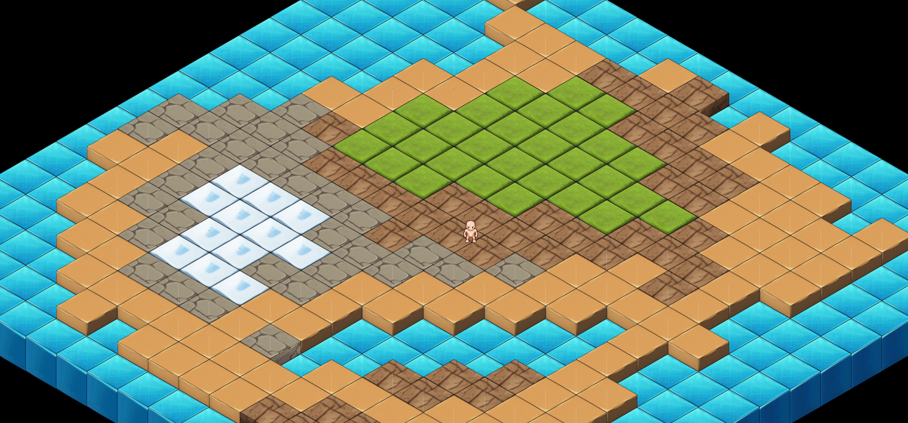

This is a simple PoC where I conduct feasibility tests for an isometric-view video game using AI to generate graphic assets. Additionally, I used the following spritesheets for the NPC: https://github.com/sanderfrenken/Universal-LPC-Spritesheet-Character-Generator

**requirements**:

- Bash shell (or Git Bash)

- Nodejs v20.x.x

- Yarn v4.x ([setup](https://yarnpkg.com/getting-started/install))

# Setup

1. *install dependencies*

```bash
yarn install
```

2. *run development web server*

```bash
yarn start:dev
```

3. *build for production*

```bash
yarn build:prod
```

# Techs

- *language*: Typescript v5

- *bundler*: [viteJs *v5.x*](https://vitejs.dev/)

- *framework*: [PixiJs *v8.x*](https://pixijs.download/release/docs/index.html)

-  *Spritesheet*: [LPC *Generator*](https://github.com/sanderfrenken/Universal-LPC-Spritesheet-Character-Generator)